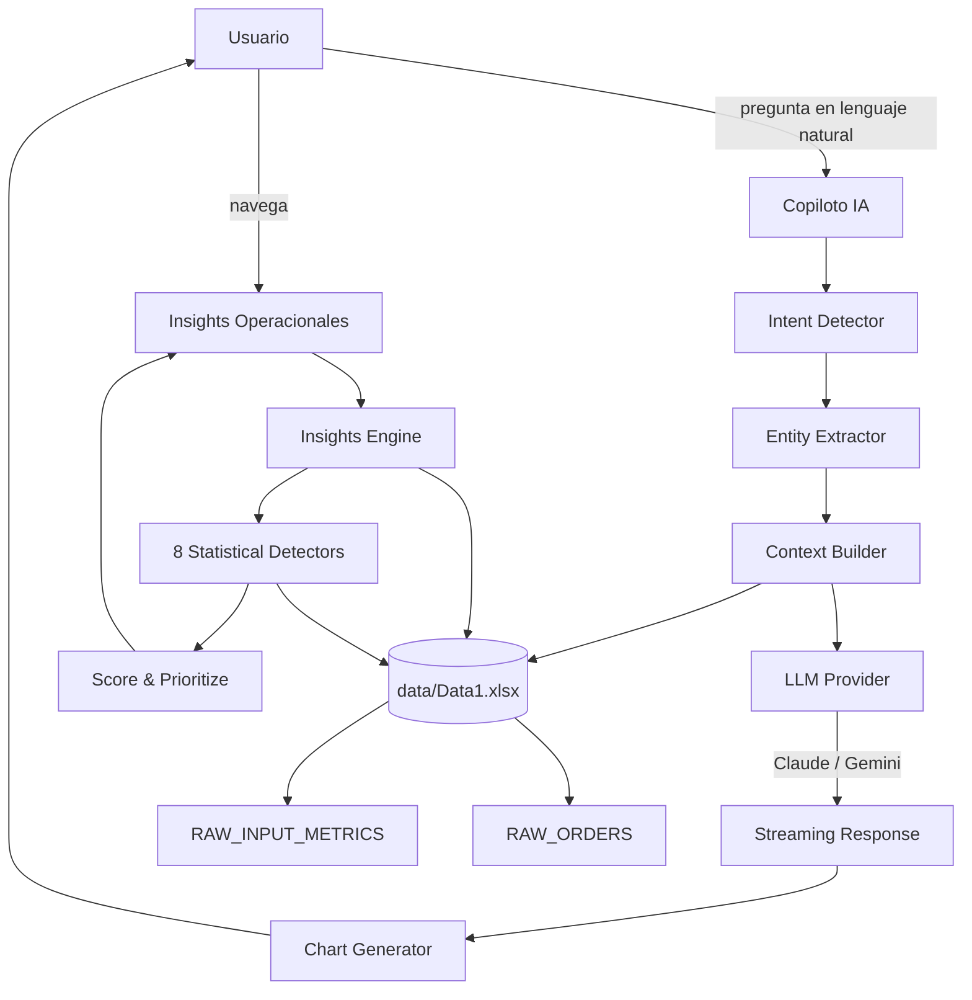

# 🛵 Rappi Operations Intelligence Platform

> **Sistema de Análisis Inteligente para Operaciones Rappi** — Caso técnico para el rol de AI Engineer.

Una plataforma de analytics operacional de nivel production que combina un **motor de insights estadísticos automáticos**, un **copiloto conversacional con IA** y **visualizaciones interactivas** para que equipos de SP&A y Operaciones de Rappi tomen decisiones basadas en datos en tiempo real, a escala de toda LATAM.

---

## 🎯 Problem Statement

Los equipos de operaciones de Rappi gestionan **+964 zonas** en **9 países de LATAM**, monitoreando **13 métricas críticas** con granularidad semanal. El problema no es la falta de datos — es que el volumen de señales supera la capacidad humana de procesarlas y priorizarlas sin herramientas analíticas dedicadas.

**Sin esta plataforma**, un analista de SP&A necesitaría:
- Revisar manualmente cientos de filas de Excel para detectar deterioros semana a semana
- Realizar benchmarking de zonas vs. promedios de país y segmento de forma manual
- Formular preguntas ad hoc sobre correlaciones entre métricas sin infraestructura de respuesta
- Construir reportes ejecutivos desde cero para cada ciclo operativo

**Con esta plataforma**, el mismo analista puede:
- Obtener automáticamente las alertas críticas ordenadas por severidad e impacto
- Preguntar en lenguaje natural y recibir respuestas con datos reales, gráficas y acciones recomendadas
- Exportar un informe ejecutivo completo en un clic
- Detectar correlaciones cruzadas entre métricas que no serían visibles en un análisis univariado

---

## 💡 Solution Overview

La plataforma está construida sobre tres capas de inteligencia que trabajan en conjunto:

### 1. Motor de Insights Automáticos
Un sistema estadístico de **8 detectores independientes** que analizan el dataset completo en cada sesión y generan insights clasificados por severidad (`critical`, `warning`, `opportunity`, `positive`) y categoría analítica (`anomaly`, `trend`, `benchmark`, `correlation`, `opportunity`). Los insights incluyen hallazgo, explicación de negocio y acción recomendada.

### 2. Copiloto IA Conversacional
Un chatbot especializado en analytics de operaciones que:
- Detecta la **intención analítica** de cada pregunta (ranking, tendencia, comparación, crecimiento, oportunidad) mediante NLP con expresiones regulares multilenguaje (ES/EN)
- **Pre-computa los datos exactos** relevantes a la pregunta antes de invocar al LLM, eliminando alucinaciones
- **Genera gráficas Plotly automáticamente** sincronizadas con los datos calculados
- Sugiere preguntas de seguimiento como chips interactivos
- Mantiene historial de conversación con contexto de los últimos 6 turnos

### 3. Visualizaciones y Exportación
Dashboards con benchmarks por país, señales WoW (semana a semana), tendencias de 8 semanas y distribución por tipo de zona. Exportación a HTML, PDF, Markdown y CSV, con preview de informe ejecutivo embebido.

---

## ✨ Features

| Capacidad | Descripción |
|-----------|-------------|
| 🔍 **Queries complejas en lenguaje natural** | Soporta español e inglés con detección de entidades (métrica, país, ciudad, zona) y filtros de prioridad |
| 📉 **Tendencias históricas** | Series de W-8 a W-0 a nivel zona, ciudad, país o red LATAM completa |
| ⚖️ **Comparaciones multidimensionales** | Wealthy vs Non Wealthy, benchmarking por país, por tipo de zona, entre zonas de un mismo segmento |
| 🔗 **Detección de correlaciones** | 8 pares de métricas predefinidos con divergencias operativas significativas (ej. Perfect Orders alto + Turbo Adoption bajo) |
| 🚨 **Insights automáticos** | 8 detectores estadísticos que generan alertas, oportunidades y señales positivas con scores de prioridad |
| 📊 **Visualizaciones inline** | Gráficas Plotly generadas automáticamente en el chat, sincronizadas con los datos computados |
| 💬 **Memoria conversacional** | Historial de sesión con los últimos 6 pares de intercambio inyectados al contexto del LLM |
| 📤 **Exportación ejecutiva** | Informes en HTML (con CSS embebido), PDF (via fpdf2), Markdown y CSV; preview embebido en la UI |
| 🔄 **Multi-proveedor LLM** | Claude (Anthropic) y Gemini (Google) intercambiables vía variable de entorno |
| 🏷️ **Segmentación por prioridad** | Filtros por High Priority, Prioritized y Not Prioritized en todas las vistas analíticas |

---

## 🏗️ System Architecture

```
┌──────────────────────────────────────────────────────────────┐
│                    Streamlit Frontend (app.py)               │
│   Sidebar Nav · KPI Cards · Charts · Chat UI · Export Bar    │
└──────────────┬──────────────────────────┬────────────────────┘
               │                          │
       ┌───────▼──────┐          ┌────────▼────────┐
       │  Insights     │          │   Chat Pipeline  │
       │  Engine       │          │   (src/chat.py)  │
       │(src/insights) │          └────────┬─────────┘
       └───────┬───────┘                   │
               │              ┌────────────┼────────────┐
       ┌───────▼───────┐      │            │            │
       │ 8 Statistical │  Intent      Entity      Context
       │  Detectors    │  Detect      Extract     Builder
       └───────────────┘      │            │            │
                              └────────────┼────────────┘
                                           │
                              ┌────────────▼─────────────┐
                              │    LLM Provider Layer     │
                              │  (src/providers/)         │
                              │  ┌─────────┐ ┌─────────┐ │
                              │  │ Claude  │ │ Gemini  │ │
                              │  │Sonnet   │ │ 2.5Flash│ │
                              │  └─────────┘ └─────────┘ │
                              └───────────────────────────┘
                                           │
                              ┌────────────▼─────────────┐
                              │     Data Layer            │
                              │  (src/data_loader.py)     │
                              │  data/Data1.xlsx          │
                              │  RAW_INPUT_METRICS        │
                              │  RAW_ORDERS               │
                              └───────────────────────────┘
```

### Pipeline de Procesamiento por Consulta

```
Usuario escribe pregunta
        │
        ▼
detect_question_intent()
  ├── Regex NLP (ES/EN): temporal, ranking, growth, decline, comparison, opportunity
  ├── Entity extraction: metric, country, city, zone (longest-match + fuzzy stem)
  └── Priority filter: High Priority / Prioritized / Not Prioritized
        │
        ▼
build_dynamic_context()
  ├── build_full_context()    → snapshot de 13 métricas (top/bottom 5, SaS, trend)
  ├── build_entity_context()  → serie histórica W-8→W-0 para zona/ciudad/país detectado
  └── compute_query_analytics() → tablas markdown pre-computadas (rankings, oportunidades)
        │
        ▼
stream_response(provider)
  └── LLM recibe [CONTEXT] + [QUESTION] → genera respuesta + bloque chart JSON
        │
        ▼
Post-processing
  ├── parse_chart_spec()      → extrae JSON del bloque ```chart
  ├── compute_intent_chart()  → construye figura Plotly desde datos reales
  └── extract_suggested_question() → renderiza chip de seguimiento
```

### Generación de Insights (Pipeline Estadístico)

```
DataFrame completo
        │
        ├── detect_wow_changes()            WoW > ±10% (L1W → L0W)
        ├── detect_consecutive_decline()    3 semanas bajando consecutivas
        ├── detect_sustained_improvement()  3 semanas subiendo consecutivas
        ├── detect_opportunity_zones()      z-score < -1.2 vs promedio país
        ├── detect_priority_zone_risk()     High Priority con WoW < -5%
        ├── detect_zone_type_benchmarking() z-score < -1.5 dentro del mismo ZONE_TYPE
        ├── detect_country_benchmarking()   País vs red LATAM (z-score < -1.0)
        └── detect_metric_correlations()    Divergencia en 8 pares de métricas
                │
                ▼
        Deduplication (zona, métrica) → keep highest severity
                │
                ▼
        Sort: severity → |delta_pct| desc
                │
                ▼
        Per-category caps (escalan con n_países en scope)
                │
                ▼
        prioritize_insights() → diversity pass + greedy fill + diminishing returns
```

### Diagrama de componentes (Mermaid)



---

## 🧰 Tech Stack

| Capa | Tecnología | Versión | Rol |
|------|-----------|---------|-----|
| **Frontend / App** | Streamlit | ≥1.32 | Framework de UI, routing de páginas, session state |
| **Data Processing** | Pandas | ≥2.0 | Manipulación de DataFrames, agregaciones, filtros |
| **Visualización** | Plotly | ≥5.18 | Gráficas interactivas (bar, line, pie, horizontal bar) |
| **LLM — Claude** | Anthropic SDK | ≥0.25 | Proveedor primario; streaming via Messages API |
| **LLM — Gemini** | google-generativeai | opcional | Proveedor alternativo; streaming nativo |
| **Report Export** | fpdf2 | ≥2.7 | Generación de PDFs ejecutivos |
| **Data Source** | Excel / openpyxl | ≥3.1 | Lectura de hojas `RAW_INPUT_METRICS` y `RAW_ORDERS` |
| **Config** | python-dotenv | ≥1.0 | Carga de variables de entorno desde `.env` |
| **Caching** | `@st.cache_data` | built-in | Dataset cacheado en memoria entre reruns de Streamlit |

### Decisiones de arquitectura

**¿Por qué Streamlit?** Permite construir aplicaciones de datos interactivas con código Python puro. Para un caso técnico con timeline acotado, elimina la necesidad de una capa frontend separada sin sacrificar UX — la app resultante tiene la misma calidad visual de un SPA gracias al CSS personalizado inyectado.

**¿Por qué pre-computar contexto en lugar de RAG?** El dataset tiene dimensionalidad acotada y semántica controlada. Pre-computar rankings, tendencias y correlaciones antes de invocar al LLM garantiza respuestas basadas en datos exactos, elimina alucinaciones y reduce latencia comparado con un sistema RAG con embeddings. El context window de 2,500 tokens es suficiente para el scope actual.

**¿Por qué abstracción multi-proveedor?** El `LLMProvider` Protocol permite cambiar entre Claude y Gemini con una variable de entorno, sin modificar el pipeline. Esto hace al sistema resiliente a cambios de pricing, rate limits, o disponibilidad de modelos.

**¿Por qué detección de intención por regex y no por LLM?** Las preguntas de analytics tienen patrones predecibles y controlados. Usar regex NLP para intent detection tiene cero costo de tokens, latencia de microsegundos, y es 100% determinístico — cualquier error es auditable y corregible. El LLM se reserva para la tarea en la que agrega valor real: razonamiento, síntesis y recomendación.

---

## 📁 Repository Structure

```
rappi-analytics/
│
├── app.py                          # Entrada principal: routing de páginas, UI/CSS, diseño
│
├── src/
│   ├── __init__.py
│   ├── data_loader.py              # Lectura del Excel, queries analíticas sobre DataFrames
│   │                               # (WEEK_COLS, get_top_zones, get_wow_zones, get_weekly_trend…)
│   │
│   ├── insights.py                 # Motor de insights automáticos
│   │                               # (8 detectores, scoring, deduplicación, prioritize_insights)
│   │
│   ├── chat.py                     # Pipeline del copiloto IA
│   │                               # (intent detection, context builders, compute_intent_chart,
│   │                               #  render_chart_from_spec, stream_response, NLP extractors)
│   │
│   ├── report.py                   # Generadores de exportación ejecutiva
│   │                               # (HTML, Markdown, PDF via fpdf2, CSV, email body)
│   │
│   └── providers/
│       ├── __init__.py             # Registry de proveedores + get_provider() factory
│       ├── base.py                 # LLMProvider Protocol + jerarquía de errores
│       ├── claude.py               # Anthropic Claude (claude-sonnet-4-6, streaming)
│       └── gemini.py               # Google Gemini (gemini-2.5-flash, streaming)
│
├── prompts/
│   └── analytics_system.txt        # System prompt del copiloto (esquema del dataset,
│                                   #  templates de respuesta, reglas de formato, chart specs)
│
├── data/
│   └── Data1.xlsx                  # Dataset operacional Rappi LATAM
│                                   # Hoja 1: RAW_INPUT_METRICS (13 métricas × 9 semanas)
│                                   # Hoja 2: RAW_ORDERS (volumen de pedidos × 9 semanas)
│
├── requirements.txt                # Dependencias Python
├── .env                            # Variables de entorno (no versionado)
└── README.md
```

---

## 🚀 Installation

### Requisitos previos
- Python 3.11+
- Al menos una API key: Anthropic (`ANTHROPIC_API_KEY`) o Google Gemini (`GEMINI_API_KEY`)

### Pasos

```bash
# 1. Clonar el repositorio
git clone https://github.com/<tu-usuario>/rappi-analytics.git
cd rappi-analytics

# 2. Crear y activar entorno virtual
python -m venv venv

# Windows (PowerShell)
venv\Scripts\Activate.ps1

# macOS / Linux
source venv/bin/activate

# 3. Instalar dependencias
pip install -r requirements.txt

# 4. (Opcional) Instalar Gemini si quieres usar ese proveedor
pip install google-generativeai

# 5. Configurar variables de entorno
cp .env.example .env   # o crea el archivo manualmente
# Editar .env con tus claves (ver sección LLM Configuration)

# 6. Ejecutar la aplicación
streamlit run app.py
```

La aplicación queda disponible en `http://localhost:8501`.

---

## ⚙️ LLM Configuration

La arquitectura del sistema es **agnóstica al proveedor de LLM**. El módulo `src/providers/` implementa un `Protocol` de Python que cualquier proveedor puede satisfacer. El proveedor activo se resuelve en tiempo de ejecución mediante una variable de entorno, sin cambios en el código.

### Variables de entorno

Crea un archivo `.env` en la raíz del proyecto:

```bash
# ── Proveedor activo ──────────────────────────────────────────
# Opciones: "claude" (default) | "gemini"
LLM_PROVIDER=claude

# ── Anthropic Claude ──────────────────────────────────────────
ANTHROPIC_API_KEY=sk-ant-...

# ── Google Gemini ─────────────────────────────────────────────
GEMINI_API_KEY=AIza...

# ── OpenAI (pendiente de implementación) ─────────────────────
# OPENAI_API_KEY=sk-...
```

> **Nota:** Solo es necesaria la API key del proveedor activo. Si `LLM_PROVIDER` no está definido, el sistema usa `claude` por defecto.

### Modelos configurados por defecto

| Variable | Proveedor | Modelo default | Cambiar modelo |
|----------|-----------|---------------|----------------|
| `ANTHROPIC_API_KEY` | Anthropic | `claude-sonnet-4-6` | Editar `_DEFAULT_MODEL` en `src/providers/claude.py` |
| `GEMINI_API_KEY` | Google | `gemini-2.5-flash` | Editar `_DEFAULT_MODEL` en `src/providers/gemini.py` |
| `OPENAI_API_KEY` | OpenAI | — | [Pendiente de implementación] |

### Criterios para elegir proveedor

| Criterio | Claude Sonnet | Gemini 2.5 Flash |
|----------|--------------|-----------------|
| **Razonamiento analítico** | ⭐⭐⭐⭐⭐ Excelente | ⭐⭐⭐⭐ Muy bueno |
| **Velocidad de respuesta** | ⭐⭐⭐⭐ Rápido | ⭐⭐⭐⭐⭐ Muy rápido |
| **Costo por token** | Medio | Bajo / Free tier disponible |
| **Contexto largo** | 200K tokens | 1M tokens |
| **Disponibilidad free tier** | No | Sí (AI Studio) |

---

## 💰 Estimated API Costs

Los costos dependen del **volumen de tokens por sesión**. El sistema inyecta un contexto pre-computado de ~1,800–2,500 tokens por consulta, más el historial de los últimos 6 turnos. La respuesta generada oscila entre 300–600 tokens.

### Costo estimado por operación

| Operación | Tokens aprox. (input + output) | Claude Sonnet | Gemini 2.5 Flash |
|-----------|-------------------------------|---------------|-----------------|
| Consulta simple (ranking, comparación) | ~2,200 input + 400 output | ~$0.007 | ~$0.001 |
| Consulta con contexto histórico (tendencias) | ~2,800 input + 500 output | ~$0.009 | ~$0.001 |
| Sesión típica (10 preguntas) | ~30,000 tokens totales | ~$0.09 | ~$0.01 |
| Análisis intensivo (30 preguntas) | ~90,000 tokens totales | ~$0.27 | ~$0.03 |

> Los precios son aproximados basados en tarifas públicas a mayo 2025. Varían según tier, volumen y cambios de pricing de cada proveedor.

### Tabla comparativa de proveedores

| Provider | Model | Input (per 1M tokens) | Output (per 1M tokens) | Recommended Usage |
|----------|-------|-----------------------|------------------------|-------------------|
| **Anthropic** | claude-sonnet-4-6 | ~$3.00 | ~$15.00 | Producción · máxima calidad analítica |
| **Anthropic** | claude-haiku-4-5 | ~$0.80 | ~$4.00 | Consultas simples · alta frecuencia |
| **Google** | gemini-2.5-flash | ~$0.15 | ~$0.60 | Desarrollo · demo · free tier disponible |
| **Google** | gemini-2.5-pro | ~$1.25 | ~$10.00 | Análisis complejos · contexto muy largo |
| **OpenAI** | gpt-4o | ~$2.50 | ~$10.00 | [Pendiente de implementación] |
| **OpenAI** | gpt-4o-mini | ~$0.15 | ~$0.60 | [Pendiente de implementación] |

### Optimization Strategies

El sistema ya implementa varias estrategias de optimización de costos:

- **Context pre-aggregation**: Los rankings, tendencias y correlaciones se calculan en Python antes de enviarse al LLM, reduciendo el número de tokens necesarios vs. enviar el DataFrame completo
- **Selective context injection**: `build_dynamic_context()` solo inyecta el historial detallado (zona/ciudad/país) cuando la pregunta lo requiere — evita tokens innecesarios en consultas simples
- **History window capping**: Solo los últimos 6 pares de conversación se incluyen en el contexto (`HISTORY_PAIRS = 6`), limitando el crecimiento del contexto con sesiones largas
- **Output token cap**: `MAX_TOKENS = 2500` por respuesta; ajustable según necesidad
- **Hybrid model strategy**: Para producción a escala, se puede configurar modelos más económicos (Haiku, Flash) para consultas de ranking simples y reservar Sonnet/Pro para análisis complejos
- **Response caching**: Para respuestas frecuentes sobre el mismo snapshot de datos, `@st.cache_data` evita recalcular el contexto en cada rerun de Streamlit
- **Batch processing**: Para alertas programadas o reportes masivos, el motor de insights opera enteramente offline sin llamadas a la API

---

## 🗣️ Usage Examples

La app incluye 6 prompts de inicio predefinidos. Aquí una selección de consultas representativas:

### Rankings y top N

```
¿Cuáles son las 10 zonas con mayor Lead Penetration en LATAM esta semana?
```
```
¿Qué zonas High Priority en Brasil tienen mayor caída de Perfect Orders esta semana?
```
```
Muéstrame el top 5 de zonas con menor Gross Profit UE en Colombia
```

### Tendencias y evolución temporal

```
Muéstrame la evolución de Turbo Adoption en México en las últimas 8 semanas
```
```
¿Cómo ha cambiado Perfect Orders en la red LATAM desde W-8 hasta hoy?
```

### Comparaciones y benchmarking

```
Compara Perfect Orders entre zonas Wealthy y Non Wealthy en Colombia
```
```
¿Cuáles son los países con mayor crecimiento de pedidos en las últimas 4 semanas?
```
```
Compara Gross Profit UE entre Argentina y Chile
```

### Correlaciones y diagnóstico

```
¿Existe correlación entre Perfect Orders y Turbo Adoption a nivel de zona?
```
```
¿Qué zonas tienen alto Lead Penetration pero bajo Perfect Orders?
```
```
¿Qué zonas tienen alta adopción Pro pero sus suscriptores no hacen breakeven?
```

### Oportunidades

```
¿Dónde hay mayor oportunidad de mejora en Lead Penetration en Ecuador?
```
```
Identifica zonas prioritarias con bajo rendimiento en Gross Profit UE vs. su promedio de país
```

---

## 🔎 Automatic Insights Engine

El motor de insights corre sobre el dataset completo en cada sesión y produce señales accionables sin intervención manual. Cada insight incluye: título, hallazgo cuantificado, explicación de negocio y acción recomendada.

### Detectores implementados

| # | Detector | Tipo | Umbral | Output |
|---|---------|------|--------|--------|
| 1 | **WoW Anomaly** | Anomalía | WoW > ±10% (critical si > ±20%) | `critical` / `warning` / `positive` |
| 2 | **Consecutive Decline** | Tendencia | 3 semanas consecutivas bajando con caída acumulada > 5% | `critical` / `warning` |
| 3 | **Sustained Improvement** | Tendencia | 3 semanas consecutivas subiendo con ganancia > 4% | `positive` |
| 4 | **Opportunity Zones** | Oportunidad | z-score < -1.2 vs promedio país (o < -0.8 para High Priority) | `opportunity` |
| 5 | **Priority Zone Risk** | Anomalía | Zonas High Priority con WoW < -5% | `critical` / `warning` |
| 6 | **Within-Segment Benchmark** | Benchmark | z-score < -1.5 dentro del mismo ZONE_TYPE y país | `opportunity` |
| 7 | **Country Benchmark** | Benchmark | País con z-score < -1.0 vs red LATAM | `opportunity` |
| 8 | **Metric Correlations** | Correlación | 8 pares de métricas con divergencias z > ±0.6 | `opportunity` |

### Pares de correlaciones monitoreados

| Métrica A (alta) | Métrica B (baja) | Señal operativa |
|-----------------|-----------------|----------------|
| Perfect Orders | Turbo Adoption | Calidad operativa sin activación Turbo |
| Perfect Orders | Pro Adoption | Oportunidad de conversión al programa Pro |
| Gross Profit UE | Perfect Orders | Alta rentabilidad con calidad recuperable |
| Lead Penetration | Perfect Orders | Leads que no convierten a buena experiencia |
| Lead Penetration | Non-Pro PTC > OP | Fricción en checkout para nuevos usuarios |
| Pro Adoption | % PRO Users Who Breakeven | Riesgo de churn por baja frecuencia de pedido |
| Restaurants SST > SS CVR | Restaurants SS > ATC CVR | Alta intención sin conversión a carrito |
| Turbo Adoption | Gross Profit UE | Volumen Turbo sin margen — costos operativos altos |

### Scoring y priorización

Cada insight recibe un **score 0–100** calculado como:

```
score = min(|delta_pct|, 200) × severity_multiplier / 6.0
```

El algoritmo `prioritize_insights()` aplica una selección en dos pasadas:
1. **Diversity pass**: asegura al menos un insight de cada categoría poblada
2. **Greedy fill**: rellena los slots restantes por score ajustado, con penalización por repetición de métrica (primera ocurrencia = 100%, segunda = 60%, tercera = 30%) para evitar que una sola métrica domine la vista ejecutiva

---

## 🔭 Future Improvements

| Mejora | Impacto | Complejidad |
|--------|---------|-------------|
| **RAG con embeddings** | Respuestas más precisas para preguntas sobre zonas específicas | Alta |
| **Memoria persistente de sesión** | Personalización por analista, preferencias guardadas | Media |
| **Forecasting de métricas** | Predicción W+1 y W+2 via modelos de series de tiempo | Alta |
| **Sistema de alertas automáticas** | Notificaciones por email/Slack cuando insights críticos superan umbrales | Media |
| **Soporte OpenAI** | Agregar `OpenAIProvider` al registry de proveedores | Baja |
| **Conexión a fuente de datos dinámica** | Reemplazar Excel estático por conexión a BigQuery / Redshift | Alta |
| **Multi-user support con autenticación** | Control de acceso por país / equipo | Media |
| **Deployment cloud** | Dockerización + deploy en GCP Cloud Run o AWS ECS | Media |
| **Agentes multi-step** | Orquestación de múltiples llamadas para análisis de causa raíz autónomo | Alta |
| **Prompt caching (Anthropic)** | Activar cache de system prompt para reducir costos ~90% en tokens repetidos | Baja |

---

## 📐 Technical Decisions & Trade-offs

### Contexto pre-computado vs. RAG

**Decisión**: Pre-computar rankings, tendencias y correlaciones en Python antes de invocar al LLM.

**Razonamiento**: El dataset tiene estructura tabular conocida, dimensionalidad acotada (13 métricas, ~964 zonas, 9 países) y semántica controlada. Los cálculos estadísticos son determinísticos y auditables. Un sistema RAG con embeddings agregaría latencia, costo de indexación y riesgo de recuperación incorrecta sin beneficio para este scope.

**Trade-off**: Si el dataset creciera a millones de filas o la semántica se volviera más compleja (texto libre, imágenes, documentos), RAG o fine-tuning serían el camino correcto.

---

### Regex NLP para intent detection vs. clasificador LLM

**Decisión**: Detectar intención analítica (ranking, tendencia, crecimiento, etc.) con expresiones regulares multilenguaje.

**Razonamiento**: Cero costo de tokens, latencia de microsegundos, comportamiento completamente determinístico y auditable. Para el dominio acotado de analytics operacional, las preguntas siguen patrones predecibles.

**Trade-off**: Menos flexible ante formulaciones muy novedosas. Mitigado con fallback fuzzy matching y extracción de stems de palabras.

---

### Streamlit como framework full-stack

**Decisión**: Una sola capa Python para UI + backend + estado.

**Razonamiento**: Permite iterar rápidamente y demostrar capacidades de producción sin overhead de frontend separado. El CSS personalizado inyectado permite UX de nivel SPA. El `session_state` de Streamlit es suficiente para gestionar historial de chat y estado de reportes.

**Trade-off**: No escalable para múltiples usuarios concurrentes en producción. Para un producto real, la lógica de `src/` es portátil a una API FastAPI con un frontend React independiente.

---

## 📊 Dataset Schema

### RAW_INPUT_METRICS

| Columna | Descripción |
|---------|-------------|
| `COUNTRY` | Código ISO 2 letras (AR, BR, CL, CO, CR, EC, MX, PE, UY) |
| `CITY` | Nombre de ciudad (~270 ciudades) |
| `ZONE` | Nombre de zona (~964 zonas) |
| `ZONE_TYPE` | Segmento socioeconómico (`Wealthy` / `Non Wealthy`) |
| `ZONE_PRIORITIZATION` | Nivel operativo (`High Priority` / `Prioritized` / `Not Prioritized`) |
| `METRIC` | Nombre de la métrica (13 métricas distintas) |
| `L0W_ROLL`…`L8W_ROLL` | Valor rolling de la métrica por semana (W-0 = más reciente) |

### RAW_ORDERS

| Columna | Descripción |
|---------|-------------|
| `COUNTRY`, `CITY`, `ZONE` | Dimensiones geográficas |
| `METRIC` | Siempre `"Orders"` |
| `L0W`…`L8W` | Volumen absoluto de pedidos por semana |

### Métricas disponibles (13)

| Métrica | Proxy operativo |
|---------|----------------|
| Perfect Orders | Calidad de experiencia del usuario |
| Gross Profit UE | Rentabilidad operativa por zona |
| Turbo Adoption | Velocidad de servicio, diferenciación |
| Pro Adoption (Last Week Status) | Retención y LTV de usuarios |
| Lead Penetration | Eficiencia de captación |
| % PRO Users Who Breakeven | Salud del programa de suscripción |
| Non-Pro PTC > OP | Fricción en checkout para no-suscritos |
| MLTV Top Verticals Adoption | Engagement multivertical |
| % Restaurants Sessions With Optimal Assortment | Calidad del catálogo |
| Restaurants SS > ATC CVR | Relevancia del search en restaurantes |
| Restaurants SST > SS CVR | Intención de compra en restaurantes |
| Retail SST > SS CVR | Intención de compra en retail |
| Restaurants Markdowns / GMV | Presión promocional, dependencia de subsidios |

---

## 🏁 Conclusion

Esta plataforma demuestra que es posible construir un sistema de analytics operacional de nivel enterprise combinando **estadística aplicada**, **LLMs con contexto controlado** y **UX orientada a la acción** — sin necesitar infraestructura compleja ni pipelines de ML.

El diseño está orientado a ser **auditablemente correcto**: cada número que el copiloto presenta fue calculado en Python, no inferido por el modelo. Cada insight automático tiene un umbral explícito, un score trazable y una acción concreta. Esto hace al sistema confiable para equipos de operaciones que toman decisiones con impacto real en el campo.

La arquitectura modular de `src/providers/`, `src/insights/` y `src/chat/` está lista para escalar: nuevos proveedores de LLM, nuevas fuentes de datos, o un frontend dedicado pueden integrarse sin reescribir la lógica de negocio.

---

<div align="center">

**Rappi Operations Intelligence Platform**  
Caso técnico — AI Engineer · Rappi LATAM · 2025

</div>
